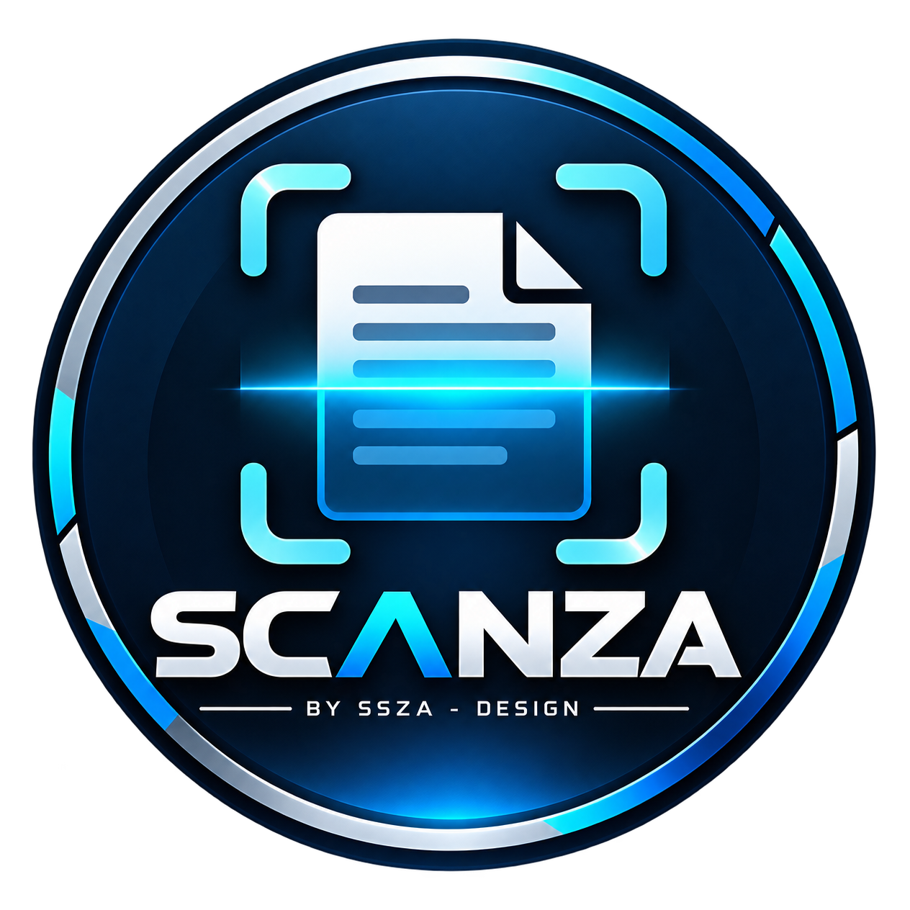

<div align="center">



# SCANZA

### Escanea · Digitaliza · Organiza

**Aplicación desarrollada por SSZA - Design**

[](#descargar-scanza)


</div>

---

## 📱 ¿Qué es Scanza?

**Scanza** es una aplicación móvil desarrollada por **SSZA - Design** para facilitar la digitalización de documentos desde un dispositivo Android.

Su propósito es convertir el teléfono en una herramienta práctica para **capturar, procesar, organizar y convertir documentos físicos en archivos digitales**, manteniendo una experiencia sencilla, rápida y visualmente limpia.

Scanza nace bajo una filosofía clara:

> **Escanear un documento debería ser rápido, sencillo y accesible.**

La aplicación se encuentra en desarrollo activo y continuará recibiendo mejoras de funcionamiento, compatibilidad, precisión y experiencia de usuario.

---

## ✨ Scanza v0.2.6

La versión actual disponible es:

### `v0.2.6`

Esta versión representa una etapa temprana pero funcional del desarrollo de Scanza.

El proyecto continuará evolucionando progresivamente sin perder su objetivo principal: ofrecer una herramienta de digitalización práctica, ligera y fácil de utilizar.

---

## 🔎 Funciones principales

Scanza está orientada a ofrecer las herramientas esenciales necesarias para trabajar con documentos desde un dispositivo móvil.

Entre sus capacidades se encuentran:

- 📷 Captura de documentos utilizando la cámara.
- 📄 Digitalización de documentos físicos.
- 🔲 Detección y procesamiento orientado al área del documento.
- ✨ Mejora visual para favorecer la legibilidad.
- 📚 Manejo de documentos de varias páginas.
- 📕 Generación de documentos PDF.
- 🔍 Reconocimiento y análisis de contenido cuando la función correspondiente está disponible.
- 💾 Administración de archivos generados.
- 📤 Opciones para compartir documentos.
- 📱 Interfaz optimizada para dispositivos móviles.
- 🌙 Diseño moderno y limpio.
- ⚡ Flujo de trabajo rápido y directo.

Scanza continuará incorporando nuevas herramientas conforme estas alcancen un nivel adecuado de estabilidad.

---

## 🎯 Filosofía del proyecto

Scanza busca evitar uno de los principales problemas de muchas aplicaciones modernas: **convertir una función sencilla en una interfaz innecesariamente complicada**.

El flujo principal está pensado alrededor de cuatro acciones:

```text
CAPTURAR
   ↓
PROCESAR
   ↓
REVISAR
   ↓
GUARDAR / COMPARTIR
```

El objetivo es que cualquier usuario pueda comprender la aplicación rápidamente sin necesitar conocimientos técnicos.

---

## 🔐 Privacidad

La privacidad de los documentos es una consideración importante dentro del diseño de Scanza.

Siempre que las características técnicas de una función lo permitan, Scanza prioriza el procesamiento directamente desde el dispositivo.

El objetivo es reducir dependencias innecesarias de servicios externos para las operaciones básicas de digitalización.

La arquitectura y las funciones futuras continuarán desarrollándose teniendo presentes cuatro principios:

**Privacidad · Simplicidad · Rendimiento · Utilidad**

---

## 📥 Descargar Scanza

La versión oficial de Scanza para Android se distribuye mediante la sección **Releases** de este repositorio.

### Versión actual

**Scanza v0.2.6**

### Plataforma

**Android**

### Formato

**APK**

Para descargarla:

1. Abre la sección **Releases** del repositorio.
2. Busca **Scanza v0.2.6**.
3. Localiza el archivo `.apk` publicado en el lanzamiento.
4. Descarga el APK en tu dispositivo Android.
5. Abre el archivo descargado.
6. Si Android solicita autorización para instalar aplicaciones desde esa fuente, concede el permiso correspondiente.
7. Pulsa **Instalar**.
8. Una vez finalizada la instalación, abre **Scanza**.

> **Importante:** descarga Scanza únicamente desde los canales oficiales publicados por **SSZA - Design**.

---

## 🔄 Actualizaciones

Scanza continuará recibiendo actualizaciones.

Cuando exista una nueva versión, estará disponible en:

**GitHub → Releases**

Las nuevas versiones podrán incluir:

- nuevas funciones;
- mejoras de escaneo;
- mejoras de procesamiento;
- correcciones de errores;
- optimizaciones de rendimiento;
- mejoras de compatibilidad;
- cambios de interfaz;
- mejoras de estabilidad;
- nuevas herramientas de administración documental.

Cada lanzamiento incluirá sus propias notas de versión cuando corresponda.

---

## 🛡️ Integridad de las descargas

Cuando una versión publicada incluya un valor de comprobación **SHA-256**, este puede utilizarse para verificar la integridad del archivo APK descargado.

Ejemplo:

```text
Archivo:
Scanza-v0.2.6.apk

Versión:
v0.2.6

SHA-256:
Consultar el valor publicado en el Release correspondiente.
```

Una coincidencia con el SHA-256 publicado permite comprobar que el archivo descargado corresponde al archivo distribuido para esa versión.

---

## 📲 Requisitos

Scanza está diseñada para dispositivos **Android**.

Los requisitos concretos pueden variar entre versiones dependiendo de las funciones incorporadas y de las capacidades del dispositivo.

Para obtener la mejor experiencia se recomienda:

- utilizar una versión de Android compatible con el APK publicado;
- disponer de cámara funcional;
- conceder únicamente los permisos requeridos por las funciones utilizadas;
- disponer de espacio suficiente para documentos y archivos PDF;
- mantener Scanza actualizada.

---

## 🔧 Tecnología

Scanza se desarrolla utilizando tecnologías modernas orientadas a aplicaciones móviles.

El proyecto utiliza componentes relacionados con:

```text
Flutter
Android
Cámara
Procesamiento de imágenes
Escaneo de documentos
Reconocimiento de contenido
Generación de PDF
Administración de archivos
Compartición de documentos
```

La arquitectura continuará evolucionando conforme avance el proyecto.

---

## 🧭 Principios de diseño

### Simple

Las funciones principales deben estar disponibles sin navegar por menús innecesariamente complejos.

### Rápido

El proceso de digitalización debe requerir la menor cantidad razonable de pasos.

### Claro

Cada herramienta debe comunicar claramente qué hace.

### Consistente

Las nuevas versiones deben preservar una experiencia reconocible para el usuario.

### Funcional

Las decisiones de diseño deben favorecer el uso real de la aplicación por encima de elementos puramente decorativos.

---

## 🚧 Estado del proyecto

Scanza se encuentra actualmente en:

### 🟦 Desarrollo activo

La versión **v0.2.6** no representa el final del proyecto.

Scanza continuará creciendo mediante versiones progresivas enfocadas en mejorar su capacidad de digitalización y administración documental.

Al tratarse de software en evolución, algunas características pueden cambiar, ampliarse o mejorarse en futuras versiones.

---

## 💡 Objetivo

Scanza pretende convertirse progresivamente en una herramienta útil para situaciones como:

- digitalización rápida de documentos;
- documentos personales;
- documentos académicos;
- apuntes;
- formularios;
- comprobantes;
- recibos;
- documentación administrativa;
- archivos que necesiten conservarse digitalmente;
- creación rápida de documentos PDF.

El alcance continuará ampliándose conforme avance el desarrollo.

---

## ⚠️ Consideraciones

La calidad final de una digitalización puede depender de factores externos como:

- iluminación;
- enfoque de la cámara;
- resolución del dispositivo;
- estado físico del documento;
- sombras;
- reflejos;
- movimiento durante la captura;
- contraste entre el documento y el fondo.

Para obtener mejores resultados se recomienda utilizar buena iluminación y mantener el dispositivo estable durante la captura.

---

## 🤝 Apoya el proyecto

Scanza es desarrollado como parte de los proyectos de **SSZA - Design**.

Puedes apoyar el desarrollo siguiendo nuestros canales oficiales:

**Facebook**  
https://www.facebook.com/ssza-design

**TikTok**  
https://www.tiktok.com/@sszadesign

**YouTube**  
https://youtube.com/@sanmihackz

**Instagram**  
SSZA - Design

El apoyo de la comunidad contribuye a continuar desarrollando Scanza y futuros proyectos.

---

## 🐛 Errores y sugerencias

Si encuentras un problema durante el uso de Scanza, puedes reportarlo mediante las herramientas disponibles en este repositorio.

Cuando reportes un error, intenta incluir:

- versión de Scanza;
- modelo del dispositivo;
- versión de Android;
- descripción del problema;
- pasos para reproducirlo;
- captura de pantalla, cuando sea posible.

Evita publicar documentos privados, información personal o información sensible dentro de un reporte público.

---

## ©️ Identidad y distribución

**Scanza** es un proyecto desarrollado por **SSZA - Design**.

El nombre del proyecto, identidad visual, logotipos y demás recursos gráficos pertenecientes al proyecto no deben interpretarse como de libre utilización únicamente por encontrarse visibles públicamente en este repositorio.

La disponibilidad de versiones compiladas de Scanza tampoco implica, por sí misma, la publicación del código fuente ni una autorización general para modificar, redistribuir o comercializar el software.

Los términos específicos aplicables al software serán los establecidos por **SSZA - Design** para cada distribución.

---

<div align="center">


### SSZA - Design

**Software · Tecnología · Desarrollo**

---

### SCANZA

**Escanea · Digitaliza · Organiza**

**v0.2.6**

Desarrollado por **SSZA - Design**

© 2026 SSZA - Design

</div>
